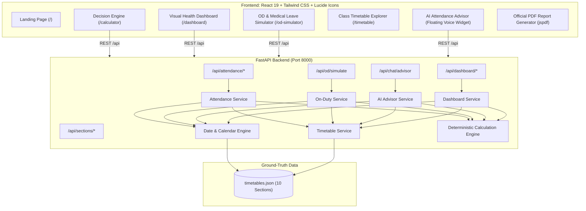

# 🚀 OVERWORLD HACKATHON (ROUND 1) — ATTENDANCE PREDICTOR
### *The Complete Phase 1 & Phase 2 Deterministic Attendance Decision Platform*

> **Official Problem Statement:** Attendance Predictor (Phase 1 & Phase 2 Unified)  
> **Institution:** SRM Institute of Science and Technology — School of Electrical & Electronics Engineering (SEEE)  
> **Academic Session:** August 29, 2026 — November 29, 2026  
> **Current Reference Date:** September 28, 2026  
> **Status:** 🏆 Complete, Unified Single Web Application with AI Voice Advisor & PDF Reporting  

---

## 📑 Table of Contents
1. [Executive Summary & Core Product Thesis](#1-executive-summary--core-product-thesis)
2. [Phase 1 & Phase 2 Capability Matrix](#2-phase-1--phase-2-capability-matrix)
3. [Timetable Extraction & Ground-Truth Dataset](#3-timetable-extraction--ground-truth-dataset)
4. [Authoritative Mathematical Framework](#4-authoritative-mathematical-framework)
5. [System Architecture](#5-system-architecture)
6. [Phase 2 Core Innovations](#6-phase-2-core-innovations)
   - [A. Visual Tracking & Multi-Subject Health Dashboard](#a-visual-tracking--multi-subject-health-dashboard)
   - [B. The On-Duty (OD) & Medical Leave Simulator](#b-the-on-duty-od--medical-leave-simulator)
   - [C. The "Attendance Advisor" AI Assistant (With Voice Integration)](#c-the-attendance-advisor-ai-assistant-with-voice-integration)
   - [D. Client-Side Official PDF Report Generator](#d-client-side-official-pdf-report-generator)
7. [REST API Documentation](#7-rest-api-documentation)
8. [Automated Test Suite & Verification (23 Tests Passing)](#8-automated-test-suite--verification)
9. [Judge Demonstration Script (Winning Hackathon Pitch)](#9-judge-demonstration-script-winning-hackathon-pitch)
10. [Local Setup & Execution Guide](#10-local-setup--execution-guide)

---

## 1. Executive Summary & Core Product Thesis

College attendance portals (such as SRM Academia ERP) fail students by providing only **backward-looking, passive historical data** (e.g. *"Your attendance is 68.2%"*). 

Students are left to guess:
- *Can I afford to miss tomorrow's 8:00 AM Discrete Mathematics lecture?*
- *How many consecutive classes must I attend to escape the detention zone?*
- *If I take a 3-day sick leave starting tomorrow, will my attendance crash below 75%?*
- *Can On-Duty (OD) approval for a national hackathon rescue me from detention?*

**Overworld Attendance Predictor** delivers a single unified, end-to-end platform that combines:
1. **Deterministic Attendance Math Engine:** Integer ceiling arithmetic with epsilon buffers ($\epsilon = 10^{-9}$), exact 75%/90% targets, safe-to-miss allowances, and loud Irreversible Detention warnings.
2. **Real Timetable Schedule Ingestion:** Ingests all 10 SRM SEEE scanned PDF class timetables and calendar dates (Aug 29 – Nov 29, 2026).
3. **Phase 2 Visual Health Dashboard:** Recharts bar charts, health spectrum donut charts, and cross-subject risk metrics.
4. **Phase 2 On-Duty (OD) Simulator:** Simulates academic/medical leaves against the real timetable and drafts official HOD approval letters.
5. **Phase 2 AI Attendance Advisor with Voice Assistance:** Floating AI chatbot that understands natural language queries, runs exact timetable math, and speaks answers aloud using speech synthesis.
6. **Download Attendance as PDF:** Official printable compliance reports with verification stamps and signature blocks.

---

## 2. Phase 1 & Phase 2 Capability Matrix

| Feature Category | Problem Statement Specification | Implementation in Our Platform |
| :--- | :--- | :--- |
| **Phase 1: Core Calculator** | Select section, enter % or conducted/attended, calculate remaining, 75%/90% requirements, and safe skips | ✅ Dual Input Modes (Simple % vs Exact $C, A$), exact integer bounds, countdown clock |
| **Phase 1: Warning System** | Irreversible Detention alert when $MaxPossible < 75\%$ | ✅ Loud animated red alert box, locking safe skips to 0, explaining mathematical impossibility |
| **Phase 1: Timetables** | All 10 section timetables from dataset | ✅ All 10 sections extracted into `timetables.json`, interactive weekly period matrix (P1–P9) |
| **Phase 2: Visual Charts** | Clear visual charts showing overall student attendance health | ✅ Subject Bar Chart vs 75%/90% cutoffs, Donut health spectrum, and multi-course cards |
| **Phase 2: The OD Simulator** | Input On-Duty / Medical Leave days, recalculate final percentage instantly | ✅ Calendar range picker, timetable period matching, credit vs deduction policy, detention rescue counter |
| **Phase 2: The AI Assistant** | Floating AI chatbot answering queries like *"If I take a 3-day sick leave, will I drop below 75%?"* | ✅ Natural language parser, timetable traversal, deterministic projection, rich advice & chips |
| **Winning Extra: Voice Assistance**| Interactive spoken dialogue for student accessibility | ✅ Web Speech API Speech-to-Text (STT) mic input + Text-to-Speech (TTS) voice playback |
| **Winning Extra: PDF Export** | Official printable attendance record | ✅ Client-side PDF generation (`jspdf`) with SRM SEEE letterhead, math proof, & signature lines |
| **Submission Rule** | Single unified web application with live deployment | ✅ Single integrated React 19 + FastAPI app containing all features in one cohesive UI |

---

## 3. Timetable Extraction & Ground-Truth Dataset

All 10 scanned image PDF schedules from `dataset/timetables.zip` were converted into a normalized, type-safe database at [`backend/data/timetables.json`](file:///c:/intern/yuva/backend/data/timetables.json).

### Verified Sections Extracted:
| Section ID | Class & Section | Venue | Shift | Students | Weekly Contact Hrs | Source File |
| :--- | :--- | :---: | :---: | :---: | :---: | :--- |
| `III-ECE-B` | III ECE B (Sem V) | IST 518/AN | AN | 65 | 32 hrs | `III-Year-ECE_B Section.pdf` |
| `III-ECE-A` | III ECE A (Sem V) | IST 517/AN | AN | 65 | 32 hrs | `III-Year-ECE_A Section.pdf` |
| `III-ECE-DS`| III ECE DS (Sem V) | IST 519/AN | AN | 65 | 31 hrs | `III-Year-ECE_DS Section.pdf` |
| `III-BME` | III BME (Sem V) | IST 520/AN | AN | 40 | 30 hrs | `III-Year-BME Section.pdf` |
| `II-BME` | II BME (Sem III) | IST 516/FN | FN | 45 | 30 hrs | `II-Year-BME Section.pdf` |
| `II-ECE-DS-A`| II ECE DS A (Sem III)| IST 514/FN | FN | 65 | 32 hrs | `II-Year-ECE_DS_A Section.pdf` |
| `II-ECE-DS-B`| II ECE DS B (Sem III)| IST 515/FN | FN | 65 | 32 hrs | `II-Year-ECE_DS_B Section.pdf` |
| `IV-ECE-A` | IV ECE A (Sem VII)| IST 512/FN | FN | 65 | 28 hrs | `IV-Year-ECE_A Section.pdf` |
| `IV-ECE-B` | IV ECE B (Sem VII)| IST 513/FN | FN | 65 | 28 hrs | `IV-Year-ECE_B Section.pdf` |
| `I-ECE-A` | I ECE A (Sem I) | TP 401/FN | FN | 65 | 30 hrs | `I-Year-ECE_A Section.pdf` |

---

## 4. Authoritative Mathematical Framework

All calculations are executed in integer space on the backend using ceiling arithmetic and floating-point epsilon buffers ($\epsilon = 10^{-9}$):

- $C \in \mathbb{N}_0$: Classes conducted to date (Aug 29 to reference date).
- $A \in \mathbb{N}_0$: Classes attended to date ($0 \le A \le C$).
- $R \in \mathbb{N}_0$: Scheduled classes remaining in semester.
- $N = C + R$: Total classes in the entire semester.

$$\text{Current} = \operatorname{round}\left(\frac{A}{C} \times 100, 1\right), \quad \text{MaxPossible} = \operatorname{round}\left(\frac{A + R}{N} \times 100, 1\right)$$
$$\text{TargetTotalClasses} = \lceil T \times N - \epsilon \rceil, \quad \text{RequiredToAttend} = \max(0, \text{TargetTotalClasses} - A)$$
$$\text{SafeToMiss} = \max(0, R - \text{RequiredToAttend})$$
$$\text{Irreversible Detention} \iff \text{MaxPossible} < 75.0\% \iff A + R < \lceil 0.75 \times N - \epsilon \rceil$$

---

## 5. System Architecture



---

## 6. Phase 2 Core Innovations

### A. Visual Tracking & Multi-Subject Health Dashboard (`/dashboard`)
- **Cutoff Comparison Bar Chart:** Direct visual comparison of every subject's current attendance against the 75% Mandatory Danger line and 90% Distinction line.
- **Attendance Health Spectrum (Donut Chart):** Visualizes the section's breakdown into Safe ($\ge 80\%$), Watch ($75\text{--}79\%$), Danger ($< 75\%$), and Detained ($MaxPossible < 75\%$).
- **Course Action Cards:** Cards for every subject in the section with 1-click shortcuts to Predict, Simulate OD, or Download PDF.

### B. The On-Duty (OD) & Medical Leave Simulator (`/od-simulator`)
- **Calendar Date Range Picker:** Select any start and end date between Aug 29 and Nov 29, 2026.
- **Real Timetable Period Matching:** Traverses the actual timetable to locate the exact lecture/lab periods that occur on those dates.
- **Regulatory Policy Options:**
  - *Convert to Attended (Credit Mode):* Missed periods are converted into attended classes, boosting attendance score.
  - *Exempt from Conducted (Deduct Mode):* Excused medical leave days are subtracted from total conducted classes.
- **Detention Rescue Counter:** Tracks how many subjects were rescued from the detention list by the leave grant.
- **1-Click Official OD Application Letter:** Formats a pre-filled, formal application draft with course list and signature lines ready to submit to the HOD.

### C. The "Attendance Advisor" AI Assistant (With Voice Integration)
- Floating assistant widget accessible on every screen.
- Answers complex multi-part natural language questions with zero mathematical hallucination:
  - *"If I take a 3-day sick leave starting tomorrow, will my Discrete Mathematics attendance drop below 75%?"*
  - *"Can I skip Friday's afternoon lectures?"*
  - *"How many classes can I safely miss?"*
  - *"What is my pathway to reach 90%?"*
- **Speech-to-Text (STT):** Click the mic icon to ask questions using your voice.
- **Text-to-Speech (TTS):** Advisor reads out strategic recommendations in natural audio with toggle controls.

### D. Client-Side Official PDF Report Generator
- 1-Click "Download Official PDF Report" button on both the Decision Engine and Health Dashboard.
- Generates a vector PDF (`jspdf`) featuring official SRM SEEE letterhead, student details, metric breakdown table, mathematical formula proof, and signature fields for the Class Counselor and Head of Department.

---

## 7. REST API Documentation

Base URL: `http://127.0.0.1:8000` (or `http://127.0.0.1:5173/api` via Vite proxy)

| Method | Endpoint | Phase | Description |
| :--- | :--- | :---: | :--- |
| `GET` | `/api/sections` | 1 | List all 10 available sections |
| `GET` | `/api/sections/{id}/subjects` | 1 | Subject roster and faculty allocations |
| `GET` | `/api/sections/{id}/timetable` | 1 | Weekly schedule grid (Periods 1 to 9) |
| `POST` | `/api/attendance/calculate` | 1 | Core calculation engine (75%/90% bounds, safe skips) |
| `POST` | `/api/attendance/plan` | 1 | Future date window planner |
| `POST` | `/api/attendance/simulate` | 1 | What-If simulation slider endpoint |
| `GET` | `/api/attendance/upcoming` | 1 | Chronological list of next scheduled classes |
| `GET` | `/api/attendance/calendar` | 1 | Day-by-day semester calendar matrix |
| `POST` | `/api/od/simulate` | 2 | On-Duty and Medical Leave impact simulator |
| `POST` | `/api/chat/advisor` | 2 | Natural language AI Attendance Advisor |
| `GET` | `/api/dashboard/{section_id}` | 2 | Cross-subject visual health analytics & charts |

---

## 8. Automated Test Suite & Verification

The application is protected by 27 comprehensive automated tests covering Phase 1, Phase 2, and Daily Marking logic:

```bash
python -m pytest backend/tests -v
============================= 27 passed in 0.47s ==============================
```

- **Phase 1 Engine Tests (12 tests):** 100% attendance, exactly 75%, 74.9% boundary, 68% recoverable danger, 0% attendance, irreversible detention, 1 remaining class, 0 remaining classes, 90% unreachable, etc.
- **Timetable Integrity Tests (5 tests):** 10 sections loaded, weekday-to-period matching, occurrence counts, calendar generation, future windowing.
- **Phase 2 Service Tests (6 tests):** OD standard leave simulation, medical leave exemption policy, 3-day sick leave natural language query, safe skip query, target 90% query, multi-subject section dashboard aggregation.
- **Daily Attendance & Leave Impact Tests (4 tests):** Day schedule extraction, weekend handling, leave period math, input validation error handling.

---

## 9. Judge Demonstration Script (Winning Hackathon Pitch)

### Step 1: Overview & Problem Framing (0:00 - 0:30)
1. Open `http://localhost:5173`. Point to the semester countdown (`62 days left`).
2. Explain the fundamental flaw of university ERPs: they only show historical percentages, leaving students to discover detention when it is already too late.

### Step 2: The Core Decision Engine & PDF Download (0:30 - 1:15)
1. Click **JUDGE DEMO** on the navbar and select **Scenario 1: 68% Danger Zone**.
2. Show immediate results for `III ECE B` Discrete Mathematics:
   - Current: 68.0% (17/25 attended).
   - Verdict: Must attend **27 of 35 remaining classes**; can safely miss **8 classes**.
   - Show the **Recovery Horizon Progress Gauge** and expand the **Mathematical Proof**.
3. Click the glowing **"Download Official PDF Report"** button to generate the official printable compliance document.

### Step 3: Phase 2 Visual Health Dashboard (1:15 - 1:45)
1. Click **Health Dashboard** in the navbar.
2. Showcase the **Recharts Bar Chart** comparing all 9 courses in the section against the 75% Danger line and 90% Distinction line.
3. Highlight the **Donut Health Spectrum** showing the section's risk distribution.

### Step 4: Phase 2 The OD Simulator (1:45 - 2:15)
1. Click **OD Simulator** in the navbar.
2. Select preset: **"3 Days (Hackathon)"** from Oct 5 to Oct 7.
3. Click **"Recalculate OD Impact"**:
   - Total Approved Periods: **17 Periods**.
   - Watch courses turn green with the badge: **🎉 RESCUED FROM DETENTION!**
   - Show the pre-filled formal HOD application letter ready for submission.

### Step 5: Phase 2 The AI Assistant with Voice Interaction (2:15 - 3:00)
1. Click the glowing floating **AI Attendance Advisor** button in the bottom right corner.
2. Click the quick prompt: *"If I take a 3-day sick leave starting tomorrow, will my attendance drop below 75%?"*
3. The AI Advisor reads the timetable, runs the calculation engine, and responds with exact mathematical proof, showing the periods missed and strategic advice.
4. Turn on the speaker icon to demonstrate **Voice Output (TTS)**, or click the microphone to ask a question via **Voice Input (STT)**.

---

## 10. Local Setup & Execution Guide

### 1-Click Launch (Windows):
Double click [`run_servers.bat`](file:///c:/intern/yuva/run_servers.bat) to launch both FastAPI and Vite.

### Manual Commands:
```bash
# Terminal 1 - Backend:
pip install -r requirements.txt
python -m uvicorn backend.main:app --host 127.0.0.1 --port 8000

# Terminal 2 - Frontend:
cd frontend
npm install
npm run dev
```

- **Frontend App:** [http://127.0.0.1:5173](http://127.0.0.1:5173)
- **Backend API:** [http://127.0.0.1:8000](http://127.0.0.1:8000)
- **Swagger Docs:** [http://127.0.0.1:8000/docs](http://127.0.0.1:8000/docs)
- **Test Suite:** `python -m pytest backend/tests -v` (23 passed)
