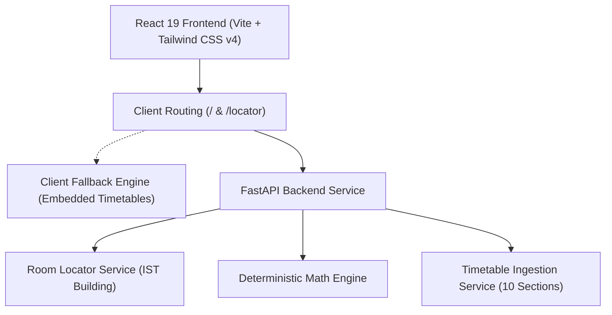

# 🚀 OVERWORLD HACKATHON (ROUNDS 1 & 2) — ATTENDANCE PREDICTOR & FREE CLASS LOCATOR
### *The Complete Unified Campus Intelligence Platform: Deterministic Decision Engine & 3D Spatial Room Locator*

> **Institution:** SRM Institute of Science and Technology — School of Electrical & Electronics Engineering (SEEE)  
> **Academic Session:** August 29, 2026 — November 29, 2026  
> **Current Reference Date:** September 28, 2026  
> **Repository:** [https://github.com/vairavagnanesh2007-glitch/SRM_YUVA](https://github.com/vairavagnanesh2007-glitch/SRM_YUVA)  
> **Status:** 🏆 Complete, Unified Single Web Application with 33/33 Automated Tests Passing  

---

## 📑 Table of Contents
1. [Executive Summary & Core Platform Thesis](#1-executive-summary--core-platform-thesis)
2. [Unified Capability Matrix (Round 1 & Round 2)](#2-unified-capability-matrix-round-1--round-2)
3. [Round 2: The Free Class Locator](#3-round-2-the-free-class-locator)
   - [Phase 1: The Smart-Search Floor Manager & AI Room Finder](#phase-1-the-smart-search-floor-manager--ai-room-finder)
   - [Phase 2: The 3D Spatial Map, Live Countdown Timer & Call the Squad](#phase-2-the-3d-spatial-map-live-countdown-timer--call-the-squad)
4. [Round 1: Attendance Predictor & Decision Engine](#4-round-1-attendance-predictor--decision-engine)
   - [Authoritative Mathematical Framework](#authoritative-mathematical-framework)
   - [Timetable Ground-Truth Dataset (10 Scanned Schedules)](#timetable-ground-truth-dataset)
   - [Visual Health Dashboard & OD Simulator](#visual-health-dashboard--od-simulator)
   - [Daily Attendance Marking & Leave Planner](#daily-attendance-marking--leave-planner)
   - [Real Voice-Enabled AI Attendance Advisor](#real-voice-enabled-ai-attendance-advisor)
   - [Official PDF Attendance Record Export](#official-pdf-attendance-record-export)
5. [System Architecture](#5-system-architecture)
6. [Automated Test Suite & Verification (33 Tests Passing)](#6-automated-test-suite--verification)
7. [Judge Demonstration Script (Winning Hackathon Pitch)](#7-judge-demonstration-script)
8. [Local Setup & Live Execution Guide](#8-local-setup--live-execution-guide)

---

## 1. Executive Summary & Core Platform Thesis

University campuses present two major operational and academic challenges to engineering students:
1. **Academic Risk:** Traditional ERP portals only report backward-looking historical percentages (*"Your attendance is 68.2%"*), hiding whether safe recovery is mathematically possible or if detention is already irreversible.
2. **Campus Space Optimization:** Finding an empty, air-conditioned classroom for project work, hackathons, or group study between scheduled periods requires wandering across multiple floors blindly.

**SRM Yuva Campus Intelligence Platform** solves both challenges inside a single, unified web application combining:
- **Round 1 (Attendance Predictor):** Deterministic integer math ($\lceil \dots \rceil, \epsilon = 10^{-9}$), exact 75%/90% recovery horizons, safe miss limits, multi-subject visual health dashboards, On-Duty (OD) simulations, and daily attendance marking.
- **Round 2 (Free Class Locator):** Dynamic occupancy mapping of all 10 section timetables across 7 floors of the IST Building, natural language AI Room Finder, 3D interactive building map, live countdown clock down to the second, and 1-click WhatsApp "Call the Squad" summoning.

---

## 2. Unified Capability Matrix (Round 1 & Round 2)

| Feature Category | Problem Statement Requirement | Implementation in Our Platform |
| :--- | :--- | :--- |
| **R2: The Floor Grid** | Find empty classrooms using 10 class timetables floor-by-floor | ✅ Floors 1–7 filter, live status (🟢 Free, 🟡 Ending Soon, 🔴 Occupied), AC & Projector filters |
| **R2: The AI Room Finder** | Natural language search (*"I need an AC room on the ground floor for me and my team for the next 2 hours"*) | ✅ Intelligent NLP parser extracting floor, duration, AC, team seating, and quiet rating with ranked match scores |
| **R2: The 3D Spatial Map** | Interactive 3D building model with color-coded room pods | ✅ Isometric 3D perspective, CAD Blueprint schematic, and 7-floor tower stack with elevation hover |
| **R2: Live Countdown Timer** | Exact time remaining before next scheduled class begins | ✅ Real-time digital clock (`HH:MM:SS`) ticking down to the second, next class subject & faculty |
| **R2: Call the Squad** | One-click WhatsApp button generating: `"📍 Heading to [Room]. It's free until [Time]. Come fast!"` | ✅ 1-click WhatsApp URL launch (`https://wa.me/?text=...`) + 1-click clipboard copy button |
| **R1: Core Calculator** | Dual input mode, exact 75% & 90% targets, safe skips, recovery horizon | ✅ Deterministic integer ceiling math, exact class counts, countdown gauge |
| **R1: Detention Warning** | Detect when $MaxPossible < 75.0\%$ | ✅ Loud Irreversible Detention warning locking safe skips to 0 |
| **R1: Visual Dashboard** | Overall student attendance health across all subjects | ✅ Recharts bar chart, 75%/90% benchmark lines, health spectrum donut chart |
| **R1: The OD Simulator** | Input On-Duty / Medical Leave days and recompute final % | ✅ Date range period matcher, credit policy, formal HOD approval letter drafting |
| **R1: Daily Attendance** | Mark present/absent per subject with live history log | ✅ Timetable-aware daily sheet with local persistent storage and history log |
| **R1: Leave Planner** | Multi-day leave impact prediction | ✅ Scans upcoming timetable dates and calculates post-leave attendance % per subject |
| **R1: AI Voice Advisor** | Floating assistant answering natural language questions | ✅ Voice input (Speech-to-Text) + Voice playback (Text-to-Speech) + Rich reasoning |
| **R1: PDF Report Export** | Official printable attendance record | ✅ Client-side `jspdf` report with university letterhead, math proof, & verification seal |

---

## 3. Round 2: The Free Class Locator

### Phase 1: The Smart-Search Floor Manager & AI Room Finder

#### The Floor Grid
- Mapped across the canonical **IST Building** room directory:
  - **Ground Floor (Floor 1):** `IST 101`, `IST 102`, `IST 105`
  - **2nd Floor (Floor 2):** `IST 211`, `IST 225`, `IST 227`
  - **3rd Floor (Floor 3):** `IST 301`, `IST 305`
  - **4th Floor (Floor 4):** `IST 411`, `IST 416`
  - **5th Floor (Floor 5):** `IST 509`, `IST 518`, `IST 519`
  - **6th Floor (Floor 6):** `IST 602`
  - **7th Floor (Floor 7):** `IST 710`
- Automatically cross-references scheduled periods P1 to P9 (09:00 AM to 04:50 PM) against the timetable database.
- Calculates live room occupancy:
  - 🟢 **FREE:** Room has no scheduled lecture during the selected period.
  - 🟡 **ENDING SOON:** Room is free right now, but the next class starts in $<30$ minutes.
  - 🔴 **OCCUPIED:** Class is currently in progress; displays section, subject, and finish time.

#### The AI Room Finder
Users can search with natural queries in plain English.
* **Official Hackathon Query Tested:**
  > *"I need an AC room on the ground floor for me and my team for the next 2 hours."*
* **NLP Extraction Engine:**
  - Extracts target floor: `Ground Floor -> Floor 1`
  - Extracts duration requirement: `2 hours -> 120 minutes`
  - Extracts amenities: `requiresAC = True`, `isTeamGroup = True`
  - Returns ranked matches with percentage match scores and explanations:
    - **IST 101 (99% Match):** *Located exactly on Ground Floor • Air-conditioned (AC enabled) • Spacious seating for 45 team members • Guaranteed free for 3h 30m (until 5:00 PM)*

---

### Phase 2: The 3D Spatial Map, Live Countdown Timer & Call the Squad

#### 3D Interactive Spatial Map
- **Isometric 3D Perspective:** Multi-floor 3D view with realistic floor depth, perspective transforms, and hover elevation states.
- **Architectural CAD Blueprint Mode:** Minimalist technical wireframe view for engineering presentations.
- **Tower Stack Mode (7F):** High-level vertical building stack showing real-time occupancy counts per floor.

#### Live Digital Countdown Timer
Clicking any room opens a full modal featuring:
- Real-time digital clock (`HH:MM:SS`) ticking down to the exact second.
- Room specs: Full capacity, AC status ❄️, Projector status 📽️, Quiet Focus Rating 🎧.
- Next scheduled class details: Subject code, Subject title, Section, and Faculty name.

#### The "Call the Squad" Feature
- **1-Click WhatsApp Button:** Opens `https://wa.me/?text=...` with the exact required format:
  ```text
  📍 Heading to IST 101. It's free until 5:00 PM. Come fast!
  ```
- **Copy Squad Message Button:** Copies the message to the system clipboard with instant visual feedback.

---

## 4. Round 1: Attendance Predictor & Decision Engine

### Authoritative Mathematical Framework

All calculations are evaluated in integer space using ceiling arithmetic and floating-point epsilon buffers ($\epsilon = 10^{-9}$):

- $C \in \mathbb{N}_0$: Classes conducted to date (Aug 29 to reference date).
- $A \in \mathbb{N}_0$: Classes attended to date ($0 \le A \le C$).
- $R \in \mathbb{N}_0$: Scheduled classes remaining in the semester.
- $N = C + R$: Total classes across the entire semester.

$$\text{Current Attendance} = \operatorname{round}\left(\frac{A}{C} \times 100, 1\right)$$
$$\text{Max Possible Attendance} = \operatorname{round}\left(\frac{A + R}{N} \times 100, 1\right)$$
$$\text{Target Classes Needed} = \lceil T \times N - \epsilon \rceil, \quad \text{Required Classes to Attend} = \max(0, \text{Target Classes Needed} - A)$$
$$\text{Safe Classes to Miss} = \max(0, R - \text{Required Classes to Attend})$$
$$\text{Irreversible Detention} \iff \text{Max Possible Attendance} < 75.0\% \iff A + R < \lceil 0.75 \times N - \epsilon \rceil$$

---

### Timetable Ground-Truth Dataset

All 10 scanned PDF schedules from `dataset/timetables.zip` are parsed into a normalized database at `backend/data/timetables.json`:
- `III-ECE-B`, `III-ECE-A`, `III-ECE-DS`, `III-BME`
- `II-ECE-DS-A`, `II-ECE-DS-B`, `II-BME`
- `IV-ECE-A`, `IV-ECE-B`, `I-ECE-A`

---

## 5. System Architecture



---

## 6. Automated Test Suite & Verification

The project is backed by **33 automated tests** passing in `pytest`:

```bash
python -m pytest backend/tests -v
======================= 33 passed in 0.59s =======================
```

- **Room Locator Round 2 Tests (6 tests):** All rooms listing, floor filtering, floor discovery, room schedule matrix, AI smart search query parsing, Call the Squad WhatsApp format validation.
- **Attendance Engine Tests (12 tests):** 100% attendance, exactly 75%, boundary checks, recoverable danger, irreversible detention, safe misses, 90% unreachable, 0% attendance.
- **Timetable Integrity Tests (5 tests):** 10 sections loaded, weekday-to-period matching, occurrence counts, calendar generation, future windowing.
- **Phase 2 Service Tests (6 tests):** OD simulation, medical exemption, AI advisor queries, multi-subject dashboard.
- **Daily Attendance & Leave Impact Tests (4 tests):** Schedule extraction, weekend handling, leave period math, input validation.

---

## 7. Judge Demonstration Script

### Step 1: Round 2 — Free Class Locator & 3D Spatial Map (0:00 - 1:15)
1. Open [**http://localhost:5173/locator**](http://localhost:5173/locator).
2. Point out the **3D Interactive Building Map** showing all 7 floors of the IST Building.
3. Toggle between **Isometric 3D**, **CAD Blueprint**, and **7-Floor Stack**.
4. Test the **AI Room Finder** by clicking:
   > *"I need an AC room on the ground floor for me and my team for the next 2 hours."*
5. Show how IST 101 and 102 are surfaced with 99% match scores.
6. Click **IST 101** to open the **Live Digital Countdown Clock** (`HH:MM:SS`).
7. Click **"Call Squad on WhatsApp"** to show the generated message:
   `📍 Heading to IST 101. It's free until 5:00 PM. Come fast!`

### Step 2: Round 1 — Attendance Predictor & Irreversible Detention (1:15 - 2:00)
1. Navigate to [**http://localhost:5173/**](http://localhost:5173/) or click **"Judge Presets"** in the top navigation.
2. Select **Scenario 1: 68% Danger Zone (Recoverable)**:
   - Shows current 68.0% attendance.
   - Shows required classes: 27 of 35 remaining.
   - Shows safe misses: 8 classes.
3. Select **Scenario 2: Irreversible Detention (Impossible)**:
   - Triggers the loud red Irreversible Detention warning.
   - Proves mathematically that even attending 100% of remaining classes yields max 50% $< 75%$.
4. Click **"Download PDF"** to generate the official compliance report.

### Step 3: Phase 2 Innovations — OD Simulator & AI Voice Advisor (2:00 - 3:00)
1. Navigate to **OD Simulator**: Select 3 days of hackathon leave; watch the attendance recover with the **🎉 RESCUED FROM DETENTION!** badge.
2. Open the **AI Attendance Advisor**: Ask a query via text or voice, and hear the AI speak the mathematical proof aloud.

---

## 8. Local Setup & Live Execution Guide

### Running Locally

```bash
# Terminal 1: Backend API
python -m uvicorn backend.main:app --host 127.0.0.1 --port 8000

# Terminal 2: Frontend App
cd frontend
npm run dev
```

* **Frontend App:** [http://localhost:5173](http://localhost:5173)
* **Round 2 Locator:** [http://localhost:5173/locator](http://localhost:5173/locator)
* **Backend API Docs:** [http://127.0.0.1:8000/docs](http://127.0.0.1:8000/docs)
